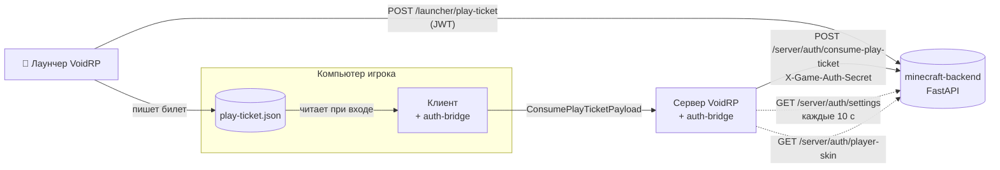
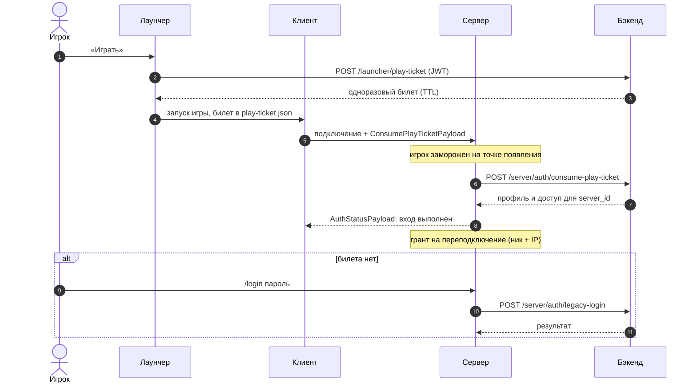

<p align="center"></p>

<div align="center">


[](https://github.com/VOIDRP-MINECRAFT/voidrp-auth-bridge/actions/workflows/build.yml)


</div>

> NeoForge-мод (клиент + сервер): вход на модовый сервер VoidRP по одноразовому play-ticket из лаунчера,
> запасной вход паролем, защищённые переподключения и собственная система скинов.

---

## 🗺️ Место в экосистеме



Пароль в игру не попадает: лаунчер получает одноразовый билет с коротким TTL, клиентская часть мода
читает его из локального файла и передаёт серверу, сервер погашает билет на бэкенде.



---

## ✨ Возможности

### Вход
- **Play-ticket** — билет из `play-ticket.json` лаунчера отправляется серверу при подключении
  (`ClientPlayerNetworkEvent.LoggingIn` → `ConsumePlayTicketPayload`), сервер погашает его на бэкенде.
- **Запасной вход паролем** — `/login <пароль>` через `POST /api/v1/server/auth/legacy-login`,
  с ограничением частоты попыток и проверкой, разрешён ли такой вход для аккаунта.
- **Доступ к серверу** — `POST /api/v1/server/auth/player-access` решает, пускать ли игрока.
- **Заморозка до входа** — пока игрок не авторизован, он удерживается на точке появления
  (`PreAuthRestrictionService`), а после выхода состояние сессии очищается.

### Переподключения
- После входа выдаётся **грант на переподключение**, привязанный к нику и IP; при повторном заходе
  доступ к аккаунту проверяется заново. Гранты продлеваются цепочкой, так что переподключаться можно
  без повторного ввода пароля.

### Настройки без рестарта
- Таймауты входа живут в `game_servers.auth_settings` на бэкенде; мод опрашивает
  `GET /api/v1/server/auth/settings` **каждые 10 секунд** и применяет изменения на лету.
  JVM-флаги задают значения до первого успешного опроса.

### Скины
- Сервер берёт скин игрока с бэкенда (`GET /api/v1/server/auth/player-skin/<ник>`) и рассылает его
  клиентам своим пакетом — скины не зависят от Mojang.
- `/voidrpskin refresh <игрок>` (консоль/OP) — мгновенная переотправка скина, её вызывает WebGUI
  после смены скина на сайте.

### Интеграция с другими модами
- События `VoidRpPlayerAuthenticatedEvent` и `VoidRpPlayerAuthSessionEndedEvent` — другие моды
  узнают о входе и выходе игрока.
- `AuthRestrictionBridge` / `AuthIntegrationRegistry` — точка подключения своих ограничений до входа.

---

## 📋 Требования

| Сборка | Minecraft | NeoForge | Java |
|---|---|---|---|
| по умолчанию | 1.21.1 | 21.1.218+ | 21 |
| `-PmcVer=26.2` | 26.2 | 26.2.0.8-beta+ | 25 |

Мод ставится **и на клиент, и на сервер**. Версионно-зависимый код лежит в `src/versions/v1211` и
`src/versions/v262`, общий — в `src/main/java`.

---

## 🚀 Сборка

```bash
./gradlew build                  # 1.21.1
./gradlew build -PmcVer=26.2     # 26.2
```

### Настройка (JVM-флаги)

Таймауты входа задаются в админке и приходят с бэкенда; JVM-флаги задают значения до первого опроса
и остаются в силе, если бэкенд недоступен, — так падение бэкенда никогда не меняет поведение входа.

| Флаг | По умолчанию | Зачем |
|---|---|---|
| `-Dvoidrp.auth.backend` | `https://api.void-rp.ru` | адрес бэкенда |
| `-Dvoidrp.auth.gameSecret` | — | `X-Game-Auth-Secret` этого сервера (админка → Серверы) |
| `-Dvoidrp.auth.graceSecs` | `120` | сколько секунд игрок может оставаться без входа до кика; `0` — без ограничения |
| `-Dvoidrp.auth.timeoutMs` | `60000` | таймаут запросов к бэкенду |
| `-Dvoidrp.auth.reconnectGrantMinutes` | `30` | срок гранта на переподключение |
| `-Dvoidrp.auth.ticketPath` | `VoidRpLauncher/state/play-ticket.json` в профиле пользователя | где клиент ищет билет |

---

## 🔗 Связанные репозитории

| Репо | Связь |
|---|---|
| [minecraft-backend](https://github.com/VOIDRP-MINECRAFT/minecraft-backend) | Выдаёт и погашает билеты, отдаёт скины и настройки входа |
| [voidrp-launcher-vue](https://github.com/VOIDRP-MINECRAFT/voidrp-launcher-vue) | Получает билет и кладёт его в `play-ticket.json` |
| [voidrp-auth-plugin](https://github.com/VOIDRP-MINECRAFT/voidrp-auth-plugin) | То же самое для плагинных серверов без модов (Origins) |

Как сервисы общаются между собой — в [документации организации](https://github.com/VOIDRP-MINECRAFT/.github/blob/main/docs/INTEGRATION.md).

---

<div align="center">
<a href="https://void-rp.ru">🌐 Сайт</a> ·
<a href="https://github.com/VOIDRP-MINECRAFT">🏠 Организация</a>
</div>
